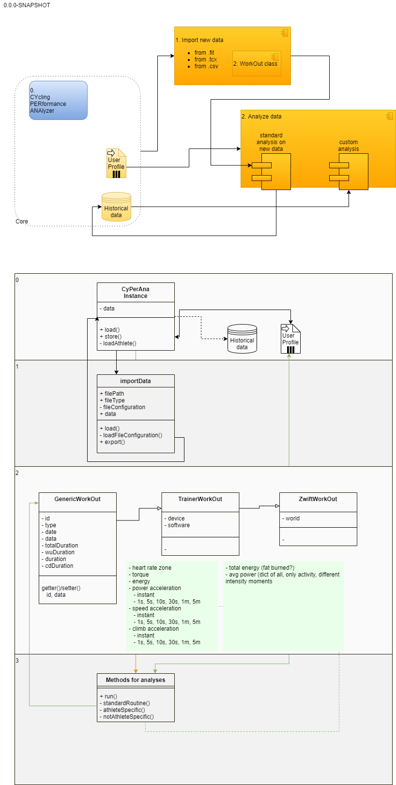

# CYcling PERformance ANAlyzer
Tool for analyzing cycling performance using records from activity trackers.

## Comment
This 2020 Christmas is the first one of my "adult" life that is free from studying-duties.
I will stay at my parents' home for a couple of weeks and probably train everyday running or cycling.

I thought about practising my coding skills on analyzing my performance and I want to exploit this opportunity to
learn/improve my knowledge on the following tools:

- python
- data encoding/decoding
- data analysis
- project management
    - github integrated issue tool
    - by exploring some drawing tools/methods (Archi, Drawio/ArchiMate, BMMP, C4, UML)
    - versioning with GIT via CLI / PyCharm tools
    - systematic unit-testing
- semantic versioning
    - I am not ashamed to say that at the moment my versioning is quite random

## Architecture

